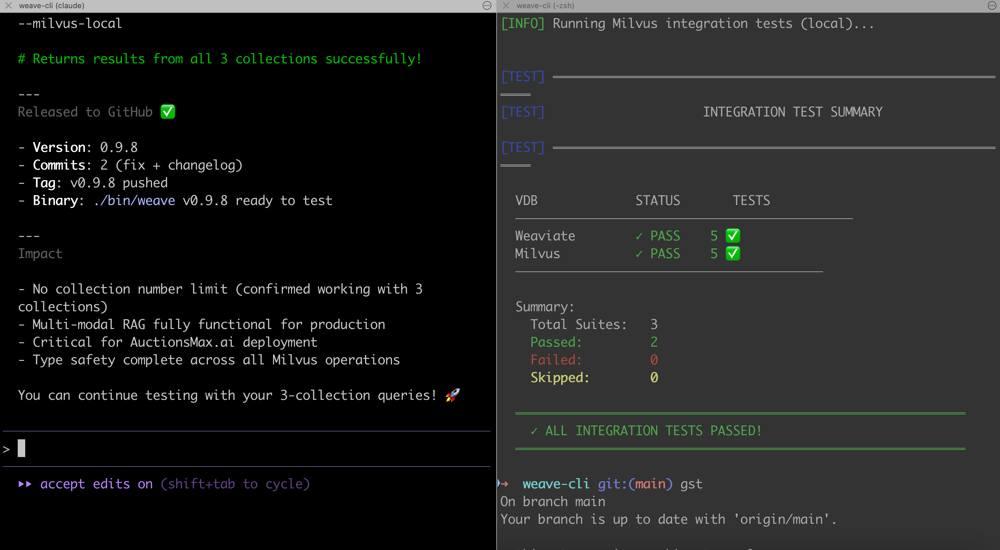
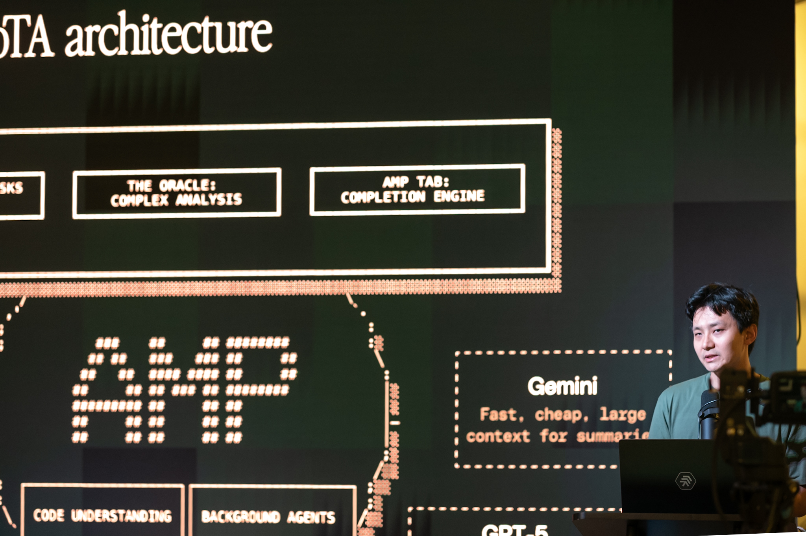

# AI Coding Assistants

*The tools that are changing how we build software—and the ones that aren't*

**TL;DR:** AI coding assistants are the most impactful AI application today, with 85% of developers using them regularly. After a year of extensive testing across Cursor, Claude Code, TRAE, and others, I've found two paradigms dominate: IDE-integrated and terminal-native. Each has strengths; all face the same fundamental challenge: context window limitations. The productivity gains are real—but so is the need for discipline around testing and review.

---

The dream of dramatically accelerated software engineering is no longer a dream.

In 2025, 41% of all code is AI-generated or AI-assisted. JetBrains reports 85% of developers regularly use AI tools for coding, with nearly nine out of ten saving at least an hour every week. These aren't incremental improvements—they're a fundamental shift in how software gets built.

I've been living in this shift for over a year. I started with Cursor, then quickly found myself testing many others as I hit limits and wanted to parallelize my work. What follows is what I've learned from building with these tools daily.

## The Landscape in Early 2026

The AI coding assistant space has exploded: Anthropic (Claude Code), Cursor, ByteDance (TRAE), Sourcegraph (Amp), GitHub Copilot, OpenAI (Codex), Google (Jules), and many others. New entrants appear monthly.

But beneath all the product names, two fundamental paradigms have emerged:

**IDE-integrated tools** like Cursor, TRAE, and Windsurf embed AI directly into a VSCode-like environment. You get visual diffs, inline suggestions, and a familiar editing experience.

**Terminal-native tools** like Claude Code, Amp, and Warp operate from the command line. You describe what you want, and the agent goes and does it—navigating files, making changes, running tests.

Both approaches have passionate advocates. Both have real limitations.

## Cursor: The First Mover

Cursor was the first major player in the IDE-focused agent space. The VSCode integration feels native because it essentially *is* native—a fork of VSCode. Your extensions work, your keybindings work.

**What works well:** Background agents let you spin up tasks in containers while you focus elsewhere. The UI for reviewing and approving changes is clear. Model flexibility means you can choose Claude, GPT-5, or others.

**My experience:** I liked the background agent workflow for parallelizing work. For UI-heavy projects, Cursor worked well, though I often found myself copying browser console output to provide context. Where it struggled was with long sessions—context approaching limits would cause the agent to slow down, "forget" earlier decisions, or make conflicting suggestions.

**Pricing (January 2026):** Hobby (Free): 2,000 completions and 50 slow requests/month. Pro ($20/mo): Unlimited completions, $20 credit pool for premium models. Pro+ ($60/mo): 3x credits. Ultra ($200/mo): 20x credits with priority access.

**Best for:** Developers who prefer GUI workflows, VSCode users, teams wanting visual code review.

## Claude Code: The Terminal-Native Revelation

Claude Code is Anthropic's bet on terminal-native development, and for me, it's been revelatory.

The philosophy differs fundamentally from Cursor. Instead of embedding AI into an existing IDE, Claude Code operates as an autonomous agent in your terminal. You describe what you want, it goes and does it—cloning repos, grepping for answers, editing files, running tests, staging commits.

**What works well:** Deep reasoning capabilities from Claude models are immediately apparent. Multi-file operations that would require careful orchestration in an IDE happen naturally. The 200K context window actually delivers—reports suggest Claude Code uses 5.5x fewer tokens than Cursor for equivalent tasks while finishing faster with fewer errors.

**My experience:** Claude Code has been the most stable and reliable tool for all my coding tasks—so compelling that I switched from Cursor's GUI to using cursor-agent (the CLI interface) as well. Even for Web UI work, Claude Code excels, though it shares the JavaScript console limitation with Cursor.

The challenge is review discipline. Speed is addictive. The terminal-based workflow makes it easy to accept suggestions without the same scrutiny you'd apply when visually reviewing diffs.

**Critical learning:** Establish strong testing practices early. Let the agent run tests after changes. Use agents to create tests too!

**Best for:** CLI-native developers, complex refactoring, multi-file operations, those who value speed over visual review.

## TRAE: The ByteDance Wildcard

I stumbled into TRAE during a meetup and did a solo hackathon day with it. Within hours, I was convinced the interface was superior to Cursor for certain workflows.

TRAE (The Real AI Engineer) has grown remarkably fast—over 6 million registered users as of late 2025. The approach is agent-focused from the ground up.

**What sets it apart:** The built-in browser is huge for UI work. No more copying JavaScript console errors—it's integrated directly. This alone solves a major friction point that Cursor and Claude Code still have. The no-interrupt run mode lets you kick off complex tasks without constant prompting, and multiple agents capability means you can parallelize work within the IDE itself.

**Pricing and models:** TRAE is roughly half the price of Cursor. However, ByteDance removed all Claude models in November 2025 due to Anthropic's updated policy restricting services for Chinese-controlled entities. Current models include GPT-5, Gemini 2.5 Pro, Kimi-K2, and DeepSeek V3.1. For me, this is actually useful: since I use Claude Code as my primary tool, TRAE provides a counterbalance with different models for testing and alternative perspectives.

**Privacy concerns:** Independent research revealed TRAE can generate up to 500 network calls (~26MB of data) in under 10 minutes, including persistent identifiers like machine ID and hardware fingerprints. TRAE offers a "Privacy Mode" toggle, but as a ByteDance product, it remains subject to Chinese data security laws. For developers working on proprietary or government-related code, this typically necessitates a more cautious approach.

**Best for:** Developers wanting an agent-focused IDE experience, those doing heavy UI work, cost-conscious developers willing to accept ByteDance's data practices.

## Other Notable Tools

**Amp (Sourcegraph):** Innovative "Free Frontier" pricing—$10 worth of credits per day (approximately $300/month in value), replenishing hourly, with access to all frontier models including Opus 4.5. Uses MCP to load tools and context only when needed, preventing "context bloat." Beyang Liu, co-founder and CTO, spoke at our AI Agents Meetup SF #7, with his thesis: "Code review is dead; long live code review!"—the bottleneck has shifted from writing to reviewing.

**Warp:** CLI-focused with multiple tabs. Great for terminal lovers who want AI assistance without leaving their shell.

**Codex (OpenAI):** Has re-emerged as a serious agent-first tool, competitive for deterministic multi-step tasks.

**Others to watch:** Aider (open source, git-focused), Continue (open source IDE extension), Cline (Claude-focused), Windsurf (Codeium's IDE).

## The Two Paradigms

After a year of testing, the IDE vs CLI distinction is more fundamental than the specific tool you choose.

**IDE-based (Cursor, TRAE, Windsurf):** Visual view of your codebase, visual code review built into the workflow, better for those who think visually. Trade-off: more overhead, slower interactions—especially deep into a session.

**CLI-based (Claude Code, Amp, Warp):** Speed and focus without GUI overhead, excellent for parallelization (I typically work on two or three repos at once using iTerm's tabs). Trade-off: easier to miss issues, requires more discipline.

Neither is objectively better. The right choice depends on how you think about code.

## Common Challenges

All these tools share fundamental limitations:

**Context window is the biggest issue.** Every tool struggles with long contexts. Frequent summarization means the AI "forgets" earlier decisions. This is improving—Claude Code's 200K window is genuinely better than what we had a year ago—but it remains the primary constraint.

**LLM dependency is the great equalizer.** The tool is only as good as its underlying model. Integration, prompting, and workflow matter, but model quality is the foundation.

**The productivity paradox is real.** A METR study found experienced open-source developers actually took 19% *longer* with AI tools in certain contexts. Meanwhile, DX's Q4 2025 report shows 91% adoption and real-time savings. The difference? AI helps more with unfamiliar codebases and routine tasks; it can slow you down on deeply familiar code where your intuition is faster than explaining to an agent.

## Best Practices Across Tools

Whatever tool you choose, these practices make a difference:

**Testing is non-negotiable.** Agents make changes fast—tests catch mistakes and regressions. All my repos include `lint.sh`, `build.sh`, and `test.sh` that I run before and after every change: `./lint.sh && ./build.sh && ./test.sh`. I use AI to create and update these scripts, then move them to CI/CD.

**Context management matters.** I've developed conventions: NEXT_STEPS.md, TODOs.md, and CHANGELOG.md files that persist context across sessions. A docs/planning/ directory for detailed feature plans. These feel manual, but they dramatically improve agent performance.

**Planning before coding pays off.** All agents work better if you plan better and divide work into features you can execute step by step. Describe the goal, have the agent break it down, save a plan with TODOs, then execute incrementally.

**Multiple tools in parallel is normal.** 59% of developers now run three or more AI coding tools simultaneously (Qodo 2025 Report). While one agent generates code, I might use another to test and plan—then feed results back to fix or implement new features.

## Looking Forward

**Near-term:** Context management will improve dramatically. Better integration with the full development lifecycle—not just coding, but testing, deployment, and monitoring. Built-in browsers will become standard (TRAE is ahead here).

**Medium-term:** The multi-agent future is coming. You'll describe goals and let agents manage other agents. Human developers become project managers, architects, and reviewers rather than primary code writers.

## Conclusion

Two leading paradigms: IDE-integrated and terminal-native. All depend on LLM quality and face context window challenges. Choose based on your workflow preference and project needs.

The productivity gains are real—developers report 30-75% time savings. For me it's easily 50-80%. But so are the challenges: context limits, review and testing discipline, and the need to maintain your own coding skills even as you delegate more to agents.

Invest in testing infrastructure early. Develop context management strategies. Embrace the tools thoughtfully, not uncritically.

The dream of dramatically accelerated engineering isn't just a dream anymore. But realizing it requires more than downloading the latest AI IDE. It requires adapting how we work.

---

*Next post: Vector Search for AI Agents—how vector databases provide the knowledge layer that makes AI agents actually useful.*

*Previous post: [Introducing AI Musings](https://maximilien.substack.com/p/introducing-ai-musings)*

---

## Recommended Resources

**Tool Documentation:**
- Claude Code: [docs.anthropic.com](https://docs.anthropic.com)
- Cursor: [cursor.com/docs](https://cursor.com/docs)
- TRAE: [trae.ai](https://www.trae.ai)
- Amp: [ampcode.com](https://ampcode.com)

**Analysis & Research:**
- [Latent Space podcast](https://www.latent.space/) — Episodes on coding agents
- [METR Study on AI Developer Productivity](https://metr.org/blog/2025-07-10-early-2025-ai-experienced-os-dev-study/)
- [DX Q4 2025 AI Impact Report](https://getdx.com/blog/ai-assisted-engineering-q4-impact-report-2025/)
- [Qodo State of AI Code Quality 2025](https://www.qodo.ai/reports/state-of-ai-code-quality/)

**From AI Agents Meetup SF:**
- [#7: Coding Agents](https://luma.com/5ry1w1ak) — Talks from Sourcegraph, DevSwarm, TRAE, and Morph
- [AI Alliance LinkedIn Live Stream](https://www.linkedin.com/posts/the-ai-alliance_ai-agent-meetup-7-in-san-francisco-https-activity-7384387097518018560-UaOQ)
- [AI Agents Meetup SF #7 - Coding Agents - images by Dr. Max](https://photos.app.goo.gl/TCdX5td4wuvWU1FE8)
