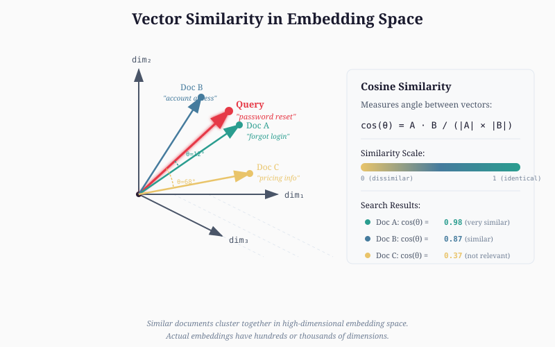
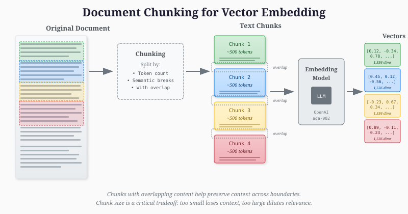
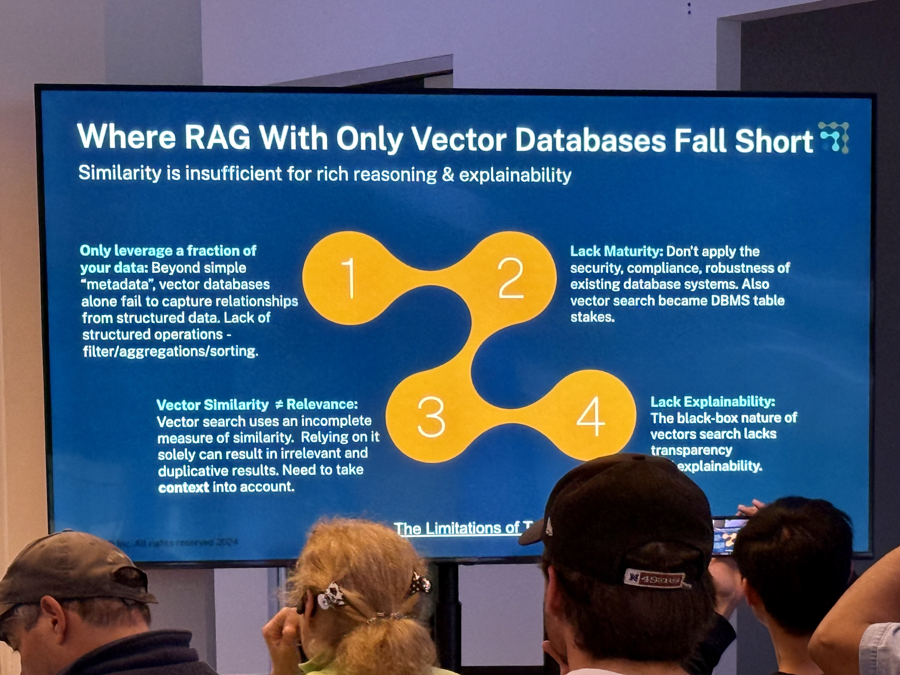

# On Vector Search: AI Agents' Knowledge

*Understanding where vector databases fit—and where they don't—in the AI agent stack*

**TL;DR:** AI agents need context to answer questions beyond their training data. MCP solved the services problem; vector databases are one answer to the knowledge problem. The market has exploded with the RAG wave—but VDBs aren't always the right choice. Understanding when to use them, and when not to, is essential for building effective agent systems.

---

AI agents need context.

Without it, even the most sophisticated model is trapped behind its training cutoff, unable to answer questions about your company's policies, last quarter's sales, or that document you uploaded five minutes ago. The agent might be brilliant at reasoning, but brilliance without knowledge is just eloquent guessing.

Two complementary solutions have emerged. The Model Context Protocol (MCP)—which Anthropic introduced in November 2024 and donated to the Linux Foundation's Agentic AI Foundation—provides a universal standard for connecting AI systems to external services and tools. MCP has seen remarkable adoption across Claude, Cursor, Gemini, and other major platforms.

But MCP solves the *services* problem. What about *knowledge*? What about the unstructured documents, the institutional memory, the domain expertise that lives in PDFs and wikis and Slack threads?

This is where vector databases enter the picture.

## What Are Vector Databases?

The core concept is deceptively simple: semantic search on unstructured data.

Traditional databases store data in rows and columns. You query them with exact matches: "Find all customers in California." This works beautifully for structured data with known schemas.

But what if you want to ask: "Find documents similar to this one"? Traditional databases can't answer because they don't understand *meaning*—only exact matches.

Vector databases solve this by storing *embeddings*: numerical representations of content that capture semantic meaning. When you embed a document, you convert its meaning into a point in high-dimensional space. Similar documents cluster together. Different documents are far apart.

*Cosine similarity measures the angle between vectors. Smaller angles mean more similar content—"password reset" and "forgot login" cluster together even though they share no keywords.*

At query time, you embed your question and find the nearest neighbors using distance metrics like cosine similarity. Finding exact neighbors in high-dimensional space is expensive at scale, so vector databases use Approximate Nearest Neighbor (ANN) algorithms—most commonly HNSW—that trade perfect accuracy for dramatic speed improvements.

The quality of your search depends heavily on your embedding model. Different models excel at different tasks—some optimized for code, others for legal text, others for multilingual content. The choice of embedding model often matters more than the choice of vector database.

## Good Uses of Vector Databases

Vector databases shine in several scenarios.

**Semantic understanding:** Unlike keyword search, vector search understands meaning. "How do I reset my password?" and "I forgot my login credentials" share no keywords, but vector search recognizes they're asking the same question. This is what makes RAG systems feel intelligent.

**Scale:** Modern vector databases handle billions of vectors with sub-100ms query times. Milvus, Qdrant, Pinecone, and others have proven this at production scale.

**Flexibility across modalities:** VDBs work with any data that can be embedded: text, images, audio, code. You can search across modalities—finding images similar to text descriptions, or documents related to diagrams.

**Ecosystem maturity:** Strong open-source options exist. Qdrant (Rust-based, excellent performance), Milvus (battle-tested at scale), Weaviate (strong hybrid search), Chroma (developer-friendly for prototyping). Cloud options like Pinecone provide managed simplicity.

## Not-So-Good Uses

Here's where honest assessment matters.

**Chunking is an unsolved problem:** To embed documents, you must chunk them—split them into pieces that fit within embedding model context windows. But chunking can split semantic meaning. A question might be answered by information spanning two chunks that never appear together in search results.

*Documents are split into overlapping chunks before embedding. Overlap helps preserve context, but no chunking strategy is perfect—semantic meaning often spans chunk boundaries.*

There's no perfect strategy. Fixed-size chunks are simple but semantically arbitrary. Semantic chunking is smarter but computationally expensive. Every choice has tradeoffs that propagate through your entire system.

**Approximate results require processing:** Vector search returns *approximate* matches ranked by similarity scores. The top results aren't guaranteed to contain the answer—they're guaranteed to be *similar* to the question, which isn't the same thing. Production systems often need re-ranking stages before presenting results.

**Cost accumulates:** Good embedding models aren't free. Vectorizing millions of documents takes time and money. For small datasets, this overhead may not be worth it.

## When Vector Databases Are the Wrong Tool

Sometimes VDBs are simply wrong for the job.

**Precise search:** If you need exact matches—specific product SKUs, legal citations, error codes—traditional search wins. Vector search optimizes for semantic similarity, which actively works against precision.

**Structured data:** If your data has known schemas, use a relational database. SQL beats semantic search for structured queries. "Show me all orders over $1,000 from Q4" doesn't need embeddings.

**Small datasets:** For collections under 10,000 chunks, the overhead often isn't worth it. Simple keyword search with BM25 might suffice.

**Relationship-heavy data:** If your questions involve traversing relationships ("What vendors does this customer's subsidiary use?"), knowledge graphs may serve you better.

## Alternatives and Complements

The RAG landscape is evolving beyond pure vector search.

**Hybrid search** combines vector similarity with keyword matching (BM25) and metadata filtering. Weaviate, Qdrant, and Pinecone support this natively. For most production systems, hybrid search outperforms pure vector search.

**Knowledge graphs** (GraphRAG and similar approaches) structure information as entities and relationships. They excel at reasoning across documents and answering questions that require connecting multiple pieces of information.

## Choosing a Vector Database

If you've determined a VDB is right for your use case:

**For prototyping:** Chroma is developer-friendly and free. If you're already on PostgreSQL, pgvector adds vector search without operational complexity.

**For production (open source):** Qdrant is my current recommendation—Rust-based, excellent performance, strong filtering. Milvus is battle-tested at billion-vector scale. Weaviate offers strong hybrid search.

**For managed simplicity:** Pinecone is fully managed and reliable. Higher cost, but minimal operational overhead.

*Hackathon participants at a recent AI Agents Meetup SF working with vector databases. The hands-on experience of building with these tools is invaluable.*

## My Experience: weave-cli

As I started experimenting creating agents and eventually created my own AI agents startup, some of the initial pain points I experienced—myself and clients—is the difficulty dealing with VDBs at scale and beyond the initial happy success.

Questions surface quickly after adding a few documents and creating a RAG agent: How do I choose the right VDB? What is the chunking strategy for my data? What embeddings should I use?

The realities of day-two operations bite fast. You need tools for quick re-ingestion of data. The ability to evaluate different VDBs and ingestion/chunking/vectorizers in a fashion that is seamless and objective. Ability to integrate into CI/CD and monitor results. And most importantly—can we achieve these without tying ourselves to a particular VDB?

To address these issues I created the open source project [weave-cli](https://github.com/maximilien/weave-cli). Out of the box it provides solutions to these questions and works across 10+ VDBs. I created it because no single VDB solved all the problems I had—sometimes I wanted the VDB to be local, sometimes hosted. Not all embeddings are supported on all VDBs. I needed a way to experiment and figure out the best vectorizer and chunking strategy, which isn't easy without a way to flexibly test across different VDBs. Weave-cli provides a solution to all these problems and more.

I plan a future post on weave-cli, but in the meantime I'd recommend perusing the [repository](https://github.com/maximilien/weave-cli) and its documentation.

## The Agent Context Story

How do vector databases fit into the broader architecture?

MCP provides the protocol for agents to connect to external tools and services. Vector databases provide the knowledge layer—the long-term memory and domain expertise that agents retrieve when answering questions.

These are complementary. An agent might use MCP to connect to your company's Slack, then use vector search to find relevant documentation based on the conversation context.

## Conclusion

Vector databases are powerful—they excel at semantic search over unstructured data and scale well. But they're not magic. They require upfront decisions about chunking, embedding models, and retrieval strategies. They work best as part of hybrid systems.

The key insight: vector databases are one tool in the agent knowledge toolkit, not the entire toolkit. Use them where they shine—semantic search at scale—and use other tools where they don't.

The dream of AI agents with comprehensive knowledge access is becoming real. MCP solved services. Vector databases are one answer to knowledge. The pieces are coming together—and understanding how they fit is essential for building agents that actually work.

---

*Next post: AI Agents Meetup SF: One Year Retrospective—lessons from nine meetups, 500+ attendees per event, and the evolution of the agent ecosystem.*

*Previous post: [AI Coding Assistants](https://maximilien.substack.com/p/ai-coding-assistants)*

---

## Recommended Resources

**Papers:**
- "Efficient and Robust Approximate Nearest Neighbor Search Using Hierarchical Navigable Small World Graphs" — the HNSW paper
- "Dense Passage Retrieval for Open-Domain Question Answering" — Karpukhin et al.

**Documentation:**
- [Pinecone Learning Center](https://www.pinecone.io/learn/)
- [Qdrant Documentation](https://qdrant.tech/documentation/)
- [Weaviate Documentation](https://weaviate.io/developers/weaviate)

**Benchmarks:**
- [ann-benchmarks.com](http://ann-benchmarks.com) — ANN algorithm comparisons
- [MTEB Leaderboard](https://huggingface.co/spaces/mteb/leaderboard) — Embedding model benchmarks

**MCP Resources:**
- [Model Context Protocol](https://modelcontextprotocol.io/) — Official documentation
