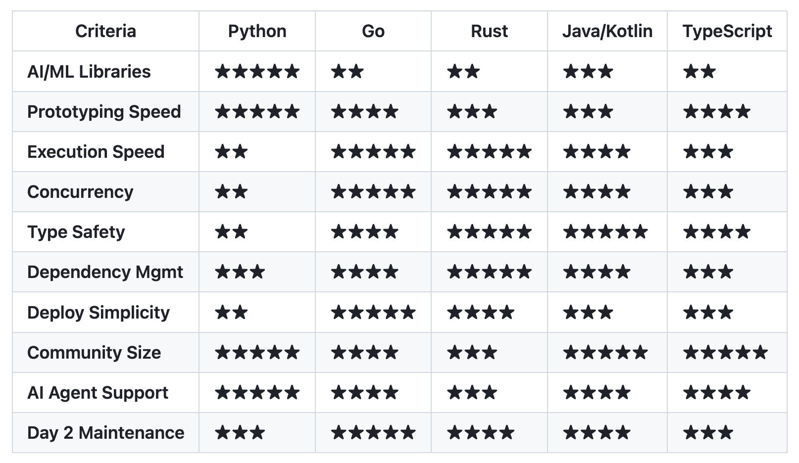
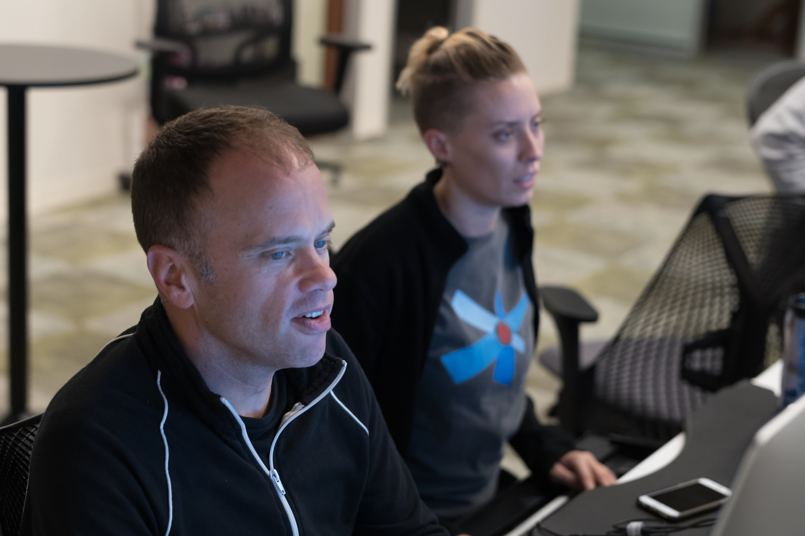
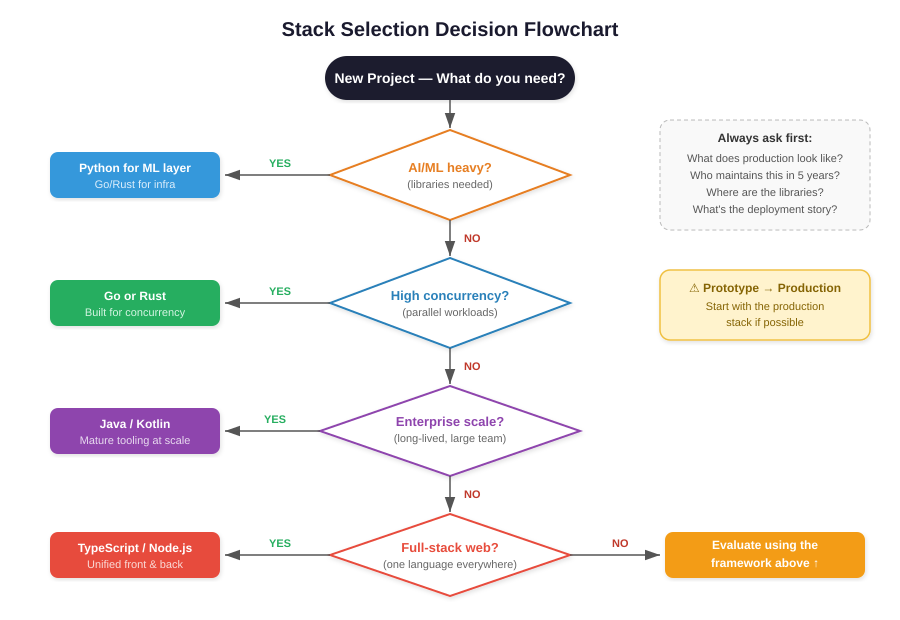

# Selecting the Right Software Stack

*The decision you make early that haunts you later—and how AI is changing the calculus*

**TL;DR:** Your software stack choice is one of the most consequential decisions you'll make on a project. Get it wrong and you'll pay in scaling headaches, debugging nightmares, and eventual rewrites. But the answer isn't to agonize over languages—it's to focus on describing your requirements clearly (performance, scale, team, deployment) and let an AI coding agent recommend a stack. Then verify the reasoning. AI agents make it easier than ever to work in unfamiliar stacks, but they can also mask fundamental architectural mismatches. Know enough to challenge the recommendation, especially before you move beyond a prototype.

---

A software stack is the collection of languages, libraries, and services you use to build a solution. For any given problem, there are dozens of reasonable choices. Is there an optimal choice? Surely one stack doesn't fit all problems?

In practice, most developers reach for what they know. The familiar stack. The one where they can be productive on day one. This is rational—familiarity reduces risk and speeds early development. But it's also how you end up maintaining a Python prototype that needed to be a Go service, or a monolithic Rails app that should have been microservices from the start.

Here's an underappreciated wrinkle: AI coding agents might actually delay the inevitability by hiding the issue. When fixing bugs and patching over problems becomes trivially easy, you might not notice that you're compensating for a fundamental stack mismatch. The ease of fixing masks the complexity of the underlying problem. But the underlying stack choice still matters—the debt compounds.

I've made this mistake. I've watched others make it. And with the current wave of AI-first development, I'm watching a new generation make it at unprecedented scale.

Python stacks have become the default choice for AI solutions. There are good reasons for this, which I'll explore below. But other stacks are possible and sometimes preferable.

**The thesis:** The choice of the correct stack is key to long-term success—but increasingly, that choice should be agent-assisted rather than habit-driven. Describe your requirements clearly, let an AI agent recommend a stack, and verify the reasoning before you start. Especially before you move beyond a prototype. AI agents make exploring unfamiliar stacks easier than ever before—but they can't save you from choosing the wrong one. And the Python AI wave will reveal its costs when prototypes need to go into production and scale.

## Why Your Software Stack Matters

A typical stack decision involves multiple interconnected choices:

**Language** — The foundation of your codebase. Some languages have built-in features that make them better suited for certain workloads. Go's goroutines handle concurrency differently than Python's asyncio. Rust's ownership model prevents entire classes of bugs. Java's type system catches errors that Python only discovers at runtime.

**Libraries** — Frameworks, utilities, and dependencies. Historical accidents mean some languages have richer ecosystems for certain domains. Python dominates AI/ML not because it's the best language for the job, but because the research community standardized on it and built numpy, scikit-learn, PyTorch, and TensorFlow there first.

**Services** — Package management, external APIs, databases, cloud infrastructure. How does your stack integrate with the services you need? How painful is deployment?

**Maintenance** — Day 2 operations: keeping software running, upgrading dependencies, managing security patches. Some stacks make this easy; others make it a constant battle. This is often the most underestimated component—it's invisible until it isn't. Anyone who has managed a Python project through a major version bump (Python 2 to 3 was legendary) or wrestled with conflicting transitive dependencies in a conda environment knows the pain.

**Non-functionals** — Performance, security, reliability, maintainability. These matter more as you scale—often revealing problems you didn't anticipate when you started. A stack that feels frictionless at prototype scale can become a bottleneck at production scale.

## The Python Ecosystem

Python has become the default choice for AI solutions. There are good reasons:

**The AI/ML ecosystem is unmatched.** PyTorch, TensorFlow, scikit-learn, pandas, numpy, LangChain, LlamaIndex—if you're building AI applications, the libraries you need are in Python first, often Python only. The research community writes Python. The tutorials are in Python. Your team probably knows Python.

**Prototyping speed is excellent.** Python's simplicity and dynamic typing let you move fast. You can go from idea to working demo in hours. For exploratory work, this matters enormously.

**AI coding agents know Python well.** The training data skews heavily toward Python, especially for AI-related code. Your AI assistant will be more helpful with Python than with less common languages.

But there are also good reasons to question Python's dominance:

**Python is slow.** Not 50x slower than C anymore, but still **5–20x slower** than compiled languages for CPU-bound work. In web service benchmarks, Go handles roughly **11x the throughput** of Python for equivalent REST API workloads—about 15,000 requests/second versus 1,300. Instagram and YouTube use Python—but they also have teams dedicated to making Python not suck at scale. You probably don't.

**Concurrency is painful.** The Global Interpreter Lock (GIL) has historically meant Python can't efficiently use multiple CPU cores within a single process. Python 3.13 introduced an experimental free-threaded mode that removes the GIL, but ecosystem support is still catching up—most libraries haven't been tested or optimized for it yet. For now, you still work around this with multiprocessing, which brings its own complexity and memory overhead.

**Type safety is optional and incomplete.** Type hints help, but they're not enforced at runtime. The tooling has improved, but it still lags behind languages designed with types from the start.

**Large codebases get messy.** Python has no component model as sophisticated as Java Spring. Structuring complex applications quickly becomes painful. The frameworks that exist (Django, FastAPI) are good, but they're not designed for the kind of large-scale systems that enterprises typically need.

**Dependency management is improving but still fragile.** Virtual environments, uv, pip, conda, poetry—the tooling has gotten better, but it's still easier to end up in dependency hell than with npm or cargo.

## Alternative Stacks Worth Considering

**Go (Golang)** — Exceptional concurrency model (goroutines and channels), fast compilation, simple deployment (single binary), strong standard library. Go excels at building the kind of high-throughput, concurrent services that AI systems often need around the core ML components. Less expressive than Python and a smaller AI/ML library ecosystem, but best for API servers, microservices, CLI tools, and infrastructure components.

**Rust** — Memory safety without garbage collection, performance comparable to C/C++, excellent package management (cargo), modern type system. Increasingly used for performance-critical AI infrastructure (Qdrant, for example, is written in Rust). Steep learning curve and slower development speed, but best for systems that need to be fast and reliable. In benchmarks, Rust uses roughly **88% less memory** than Python for equivalent workloads—about 11 MB versus 89 MB.

**Java/Kotlin** — Mature enterprise ecosystem, excellent tooling, proven at massive scale, strong type system, JVM optimizations, huge talent pool. Spring Boot provides a sophisticated component model. Verbose (Java more than Kotlin) and slower iteration than Python, but best for enterprise systems, large team projects, and anything requiring long-term maintainability.

**TypeScript/Node.js** — Full-stack unification (same language front and back), huge ecosystem (npm), good for I/O-bound services. Single-threaded event loop isn't ideal for CPU-bound work, but best for full-stack web applications and teams that want one language everywhere.

### Stack Comparison at a Glance

*Ratings reflect my experience and are intentionally opinionated. Your mileage may vary based on team and domain.*

## Evaluating Stacks: A Framework

Beyond individual languages, here's how I think about the evaluation criteria for any stack decision:

**Development Experience** — How fast can your team be productive? This includes ease of development, library availability, community quality, and prototyping speed. Note: the prototyping advantage is shrinking as AI coding agents accelerate development across all languages.

**Runtime Performance** — Execution speed, concurrency model, memory footprint, and resource usage on deployment. Go's goroutines vs Python's GIL can be a night-and-day difference. A Go binary uses a fraction of the memory of a Python process with its interpreter and dependencies. A Go container image can be **10 MB**; a Python ML image can easily be **2 GB+**.

**Architecture & Maintenance** — Type safety, dependency management, distribution model (binary vs container vs library), ease of upgrading, and security posture. These matter more as codebases grow and compound over time.

**DevOps & Tooling** — Package management workflows, CI/CD integration, containerization story, and observability tooling. Reproducible builds and small image sizes aren't glamorous, but they pay dividends at scale.

## The AI Coding Agent Factor

AI coding assistants are changing the stack selection calculus in interesting ways:

**The "familiarity tax" is lower.** It's easier than ever to be productive in an unfamiliar language. Claude or Cursor can help you write idiomatic Go even if you've never used it. This doesn't mean you'll be as fast as an expert, but the gap is smaller than it used to be.

**Rapid prototyping speed matters less.** If AI accelerates all development, the relative advantage of a "rapid prototyping" language shrinks. You can prototype in Go or Rust almost as fast as Python now.

**Documentation quality becomes more important.** AI assistants work better with well-documented APIs and clear conventions. Languages and frameworks with excellent documentation become more attractive.

**Type safety matters more, not less.** Strong type systems help AI agents reason about code correctly—types constrain the solution space and catch errors that would otherwise surface only at runtime. In an AI-assisted workflow, typed languages like Go, Rust, and TypeScript give agents (and humans reviewing agent output) better guardrails. This is one more reason to think carefully before defaulting to a dynamically-typed language for production systems.

**But architecture still requires human judgment.** AI can write code in any language. It can't tell you whether your fundamental architecture is appropriate for your problem. The Twitter-Rails mismatch would still happen today—an AI assistant would happily help you build the wrong thing faster.

**AI agents can mask problems.** When fixing bugs becomes trivially easy, you might not notice that you're fixing the same class of bugs repeatedly. AI makes it easier to patch over architectural problems rather than fix them. The pain that would have forced a rethink gets distributed into a thousand small fixes.

## AI Agents as Stack Advisors

There's a workflow shift happening that most developers haven't internalized yet: AI coding agents aren't just tools for writing code in your chosen stack. They're tools for *choosing the stack in the first place.*

Consider what happens when you describe your requirements in plain language to a capable AI agent:

> **Prompt:** "I want to develop a highly memory-efficient system with low latency for large-scale enterprise workloads. What coding language is appropriate?"

The agent will evaluate the landscape—Rust for zero-cost abstractions and compile-time memory safety, Go for pragmatic concurrency, C++ for proven scale—and make a defensible recommendation with tradeoffs laid out. It can do this because it has broad knowledge of language ecosystems, benchmarks, and production track records. Ask it to be concise and it'll give you a one-word answer: *Rust.*

This is a fundamentally different workflow from the one most of us follow. Today, even developers who use AI agents extensively tend to choose a stack first—usually the one they know—and then use the agent to code in it. Flipping that order changes everything:

1. **Start with requirements, not languages.** Instead of "I'll use Python because I know it," you articulate: "I need high concurrency, low memory footprint, simple deployment, and strong type safety." The agent maps requirements to languages.

2. **Challenge the recommendation.** This is where *your* stack knowledge matters. The comparison table earlier in this post isn't here so you can pick a stack yourself—it's here so you can evaluate whether the agent picked the right one. Can it justify why it recommended Go over Rust for your use case? Does its reasoning account for your team's experience, your deployment constraints, your maintenance timeline?

3. **Iterate before writing code.** Have the agent sketch the architecture in the recommended stack. Ask it to identify the biggest risks. Ask what would change if you chose a different language. This conversation costs minutes; a wrong stack choice costs months.

The implication is striking: your job is shifting from "pick the right stack" to "describe what you need clearly enough that an agent can pick the right stack, and know enough to verify the choice." That's the shift from developer to technical decision-maker—and it's where the industry is heading.

A friend put it bluntly: "Any stakeholder who determines the stack on behalf of the agent is in the wrong business." That's provocative and probably premature for most teams today. But the direction is clear. Programming languages are beginning to hold the same relationship to natural language requirements that assembly holds to high-level code—still essential under the hood, increasingly invisible to the person directing the work.

We're not fully there yet. You still need to understand stack tradeoffs to catch the agent's blind spots—agents default to Python for AI work just like developers do, and for some of the same lazy reasons. But the gap between "agent-recommended" and "expert-recommended" is closing fast.

## Lessons from Experience

### Twitter's Rails Journey

Twitter famously started with Ruby on Rails and suffered chronic outages as it scaled. The "Twitter can't scale" period became a cautionary tale—though the lesson people drew was often wrong.

The real problem wasn't Ruby or Rails per se. It was that Twitter's data model (a messaging system where each tweet fans out to millions of followers) was fundamentally mismatched with the CMS-style architecture Rails encourages. Any framework would have struggled with that design.

But there's still a lesson here: Rails was great for getting Twitter started quickly. It wasn't great for what Twitter became. The team eventually rewrote critical components in Scala and Java—not because Ruby is bad, but because the problem changed.

**The takeaway:** The stack that gets you to market isn't always the stack that scales. Plan for the transition, or at least be aware it may be necessary.

### Cloud Foundry

Cloud Foundry (CF) also started as a Ruby on Rails platform. And like Twitter, it suffered significantly from that choice. Building a Platform-as-a-Service designed to run applications in any stack ironically showed the CF team that Rails was the wrong choice for the core of CF. I was there and witnessed the long hours debugging.

To their credit, Pivotal—the steward of CF—took great care to enforce TDD and pair programming for all CF code. The quality of code was there, but no amount of engineering discipline could solve the original sin of the wrong stack choice.

This is why the CF team gradually replaced most of CF with Golang. It started with the CLI, which was the core entry point for anyone using CF and was executed countless times during development and by users. The Go CLI proved so successful and pleasing to users that the rest of CF explored a rewrite in Golang.

Some components remained in Ruby and Rails, but most new development had switched to Golang. This was not only the choice of CF engineers but also validated by competing PaaS platforms—Docker and especially Kubernetes—which were implemented almost entirely in Golang.

### Recent AI Agent Projects

In my current work on AI agents, I've had to make stack choices that will matter for years. The easy path is Python everywhere—LangChain, LlamaIndex, the whole ecosystem. It works. It's what the tutorials show.

But I've found that splitting the stack often makes sense: Python for the AI/ML components where the libraries live, Go or Rust for the performance-critical infrastructure, TypeScript for anything user-facing. The boundaries require careful design, but the result is a system where each part uses the best tool for its job.

One specific example is the data layer and tooling for vector databases. While it's easy to have Python scripts integrated into pipelines for these tasks, I often find that the need to execute these frequently and the need to parallelize (many documents) make languages with fast startup, low memory usage, and better parallelization a much better choice—areas where languages like Golang and Rust shine.

## Conclusion

The Python wave in AI is producing thousands of prototypes. Many will never need to scale. But some will succeed—and their teams will discover, too late, that the stack that got them to demo day isn't the stack that gets them to production.

This isn't Python's fault. It's the natural consequence of optimizing for time-to-first-demo without thinking about time-to-production-scale.

But here's the shift I want to leave you with: the solution isn't to become an expert in every language's tradeoffs. It's to get better at articulating what your system actually needs—performance constraints, scale requirements, team capabilities, deployment realities, maintenance horizons—and then use an AI coding agent to evaluate your options *before you write a single line of code.*

The stack knowledge in this post isn't here so you can pick the right language. It's here so you can verify that the agent did. Know enough about concurrency models to push back when the agent recommends Python for a high-throughput service. Know enough about type systems to question a dynamically-typed choice for a large team project. Know enough about deployment to ask whether a 2GB container image is acceptable for your infrastructure.

The old advice was: "Use the right tool for the job." The new advice is: describe the job precisely, let the agent recommend the tool, and verify the reasoning. Your role is shifting from stack selector to requirements articulator and decision verifier. The developers who thrive will be the ones who get good at that—not the ones who memorize language benchmarks.

Before your next project, try this: open a conversation with your AI coding assistant. Describe your requirements—not the solution, the *requirements*. Ask it to recommend a stack and justify the choice. Challenge the reasoning. Then decide.

You might be surprised how often it picks something you wouldn't have.

*The flowchart starts where it should: with your requirements and an AI agent, not with a language.*

---

*Next post: Hackathons as research platform.*

*Previous post: [AI Agents Meetup SF](https://maximilien.substack.com/p/ai-agents-meetup-sf-one-year-retrospective?r=4pz80): One Year Retrospective—lessons from nine meetups, 500+ attendees per event, and the evolution of the agent ecosystem*

---

## Recommended Resources

**On Python's Scaling Challenges:**
- Rod Johnson's "Production-Ready Gen AI: Beyond the Python Prototype" (Medium)
- Darryl Taft's "Your Enterprise AI Strategy Must Start With Java, Not Python" (The New Stack)
- "Why Do They Say Rails Doesn't Scale?" (codefol.io) — still relevant lessons

**On Stack Selection:**
- *Designing Data-Intensive Applications* — Kleppmann (the best book on thinking about systems)
- "The Twelve-Factor App" (12factor.net) — deployment considerations

**Language-Specific Resources:**
- Go: "Learn Go with Tests" (quii.gitbook.io)
- Rust: "The Rust Programming Language" (doc.rust-lang.org)
- Kotlin: "Kotlin in Action" — Jemerov & Isakova

**Acknowledgments:**
- Nima Kaviani (AWS) and Dmitriy Kalinin (Broadcom) — conversations with the author on the first draft. Nima's insight on agent-driven stack selection and the analogy to assembly languages, and DK's push for deeper insight and notes on Python's evolving GIL and the increasing importance of type safety, significantly shaped the final version of this post.

**Photos**
- All photos original by the author
