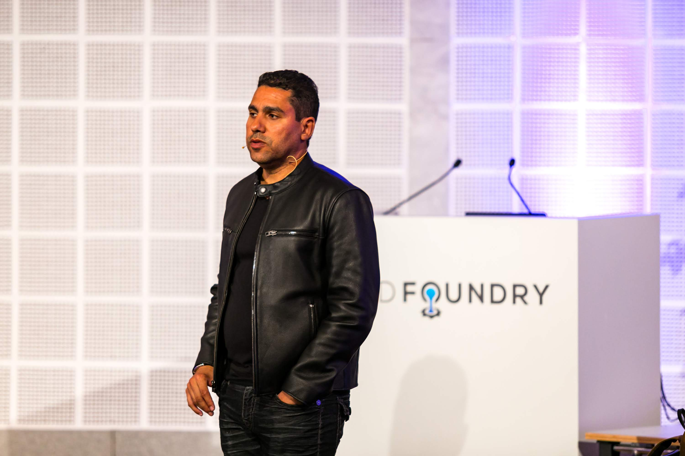
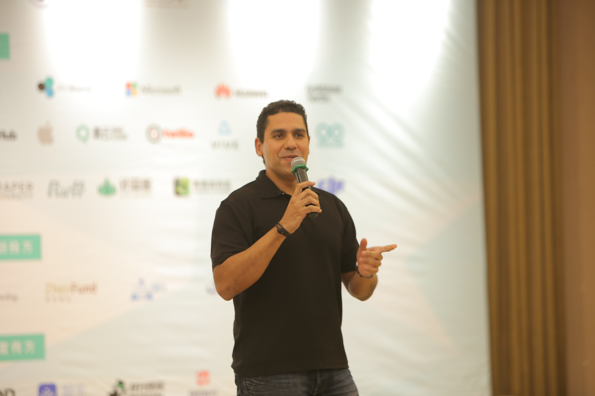
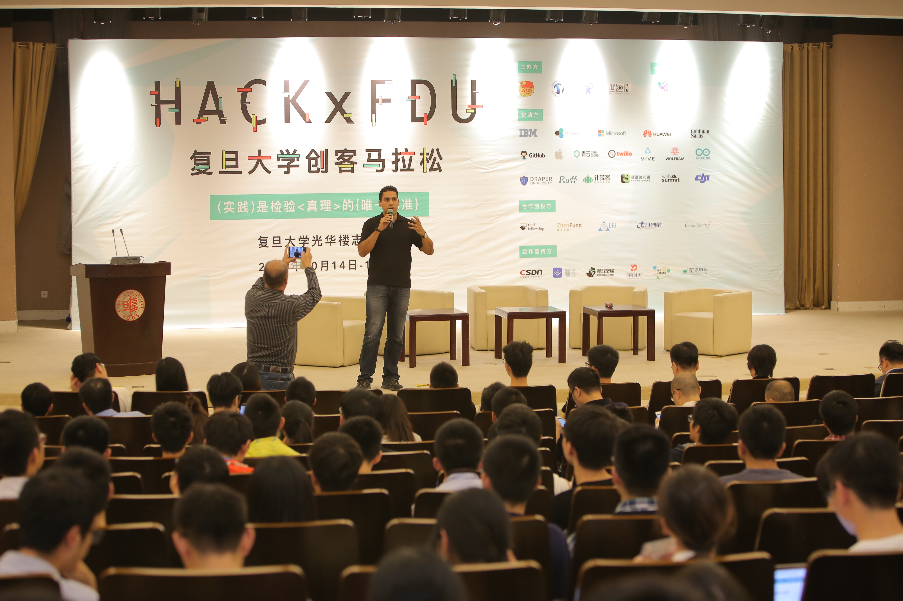
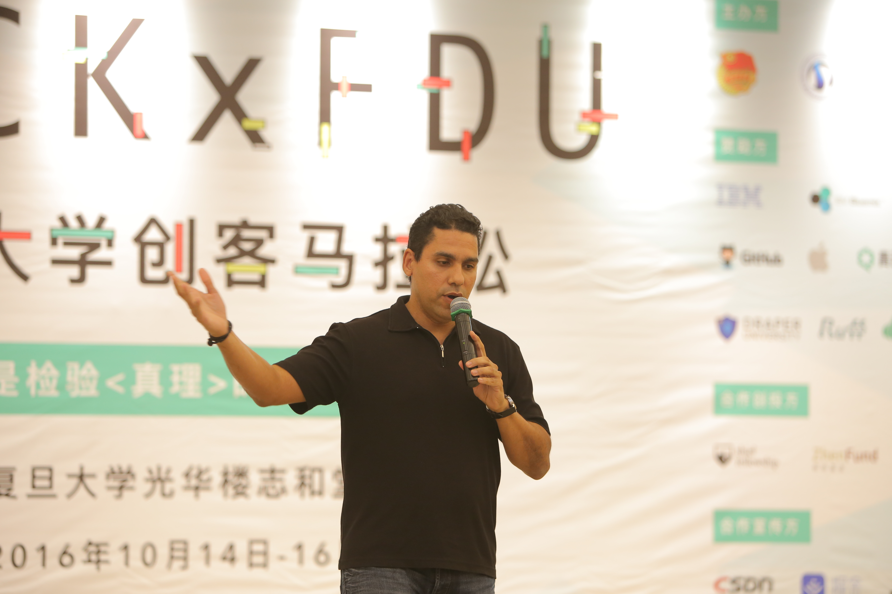
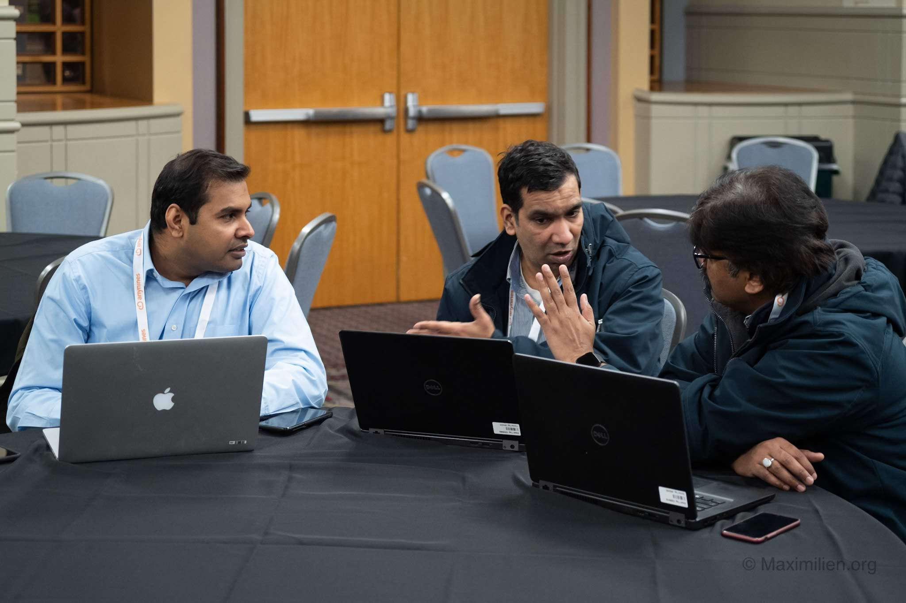
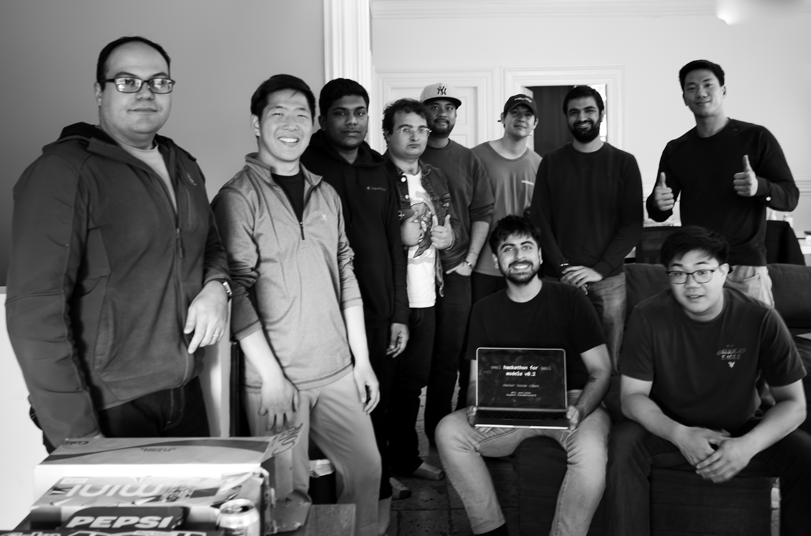

# Value of Hackathons: What I Learned from a Dozen+ Hackathons in 2025

*One of the most underrated research methodology in tech—and a personal playbook for winning*

**TL;DR:** I participated in over a dozen hackathons in 2025 and came away with more than projects and prizes. Hackathons are scoped, time-boxed, and force you to ship—but they're also accidental research labs where you can observe how people actually build, what tools they reach for, and what strategies work under pressure. This post shares what I learned, what worked, what didn't, and why hackathons deserve recognition as one of the most efficient ways to learn, build, and connect—especially in the age of AI.

---

Hackathons are one of the best ways to innovate. Period.

They're scoped. They're time-boxed. They force you to ship something—anything—by a hard deadline. In a world where projects can drag on for weeks in planning purgatory, there's something liberating about having 24 to 48 hours to turn an idea into a working demo.

But after doing over a dozen of them in 2025, I've come to see hackathons as something else entirely: accidental research labs. You don't just build things at hackathons—you learn how other people build things. You see what tools they reach for, what strategies they use, what shortcuts work and what shortcuts break. And if you're paying attention, that observational data is as valuable as anything you code.

This post is everything I learned from that year of hacking. A playbook, a set of lessons, and a case for why hackathons might be one of the most underrated methodology in tech.

## Why Hackathons Still Matter

Hackathons aren't new. The concept traces back to 1999, when OpenBSD held what's considered the first modern hackathon. But the scene has exploded—especially in the Bay Area, where you can find dozens every week covering AI agents, climate tech, fintech, healthcare, and everything in between. Lu.ma is the best way to discover what's happening, and the calendar is relentless.

What *is* new is what you can build in 24 hours. The rise of AI coding assistants—Claude Code, Codex, Cursor, Lovable, Replit Agent—has fundamentally changed the game. Projects that would have taken a team of five engineers weeks to prototype can now be built by one or two people in a weekend. The barrier to shipping something real has never been lower.

I got hooked after my first one. I went in expecting a coding sprint and came out with a working project, various new connections even when I hacked alone, and a completely different mental model for how fast you can move when constraints are tight. So I kept going back. And the thing I did not fully realize before I started is that hackathons aren't just about building—they're about learning how people build. What tools they use, what services are new and useful, what approaches work under real pressure. That's where it gets interesting.

## Hackathons as Accidental Research Labs

The traditional view of hackathons is straightforward: they're competitions. You show up, you code, you network, maybe you win a prize. All true.

But there's an emerging view that I find more compelling: hackathons are controlled environments for studying innovation and tool usage. And the conditions are uniquely useful for exactly this kind of observation.

**Time compression** forces decisions that might take weeks in normal development. You see people's real instincts—not their considered, committee-approved choices, but what they actually reach for when the clock is ticking. **Diverse participants** with varied skill levels, backgrounds, and approaches all tackle the same problems, giving you organic comparison data. **Real motivation** from prizes and competition drives authentic engagement—this isn't a lab study where participants are going through the motions. And **low-stakes experimentation** means people try things they'd never risk in production, which is where the most interesting discoveries happen. **AI assistants** truly change the landscape since everyone can be productive and reduces the need to outside help or get unstuck quickly thereby enabling all to take advantage of the scoped time.

Researchers have caught on to this. Lilly Irani's work on hackathons as cultural rituals and Nolte et al.'s research on collaborative innovation at HICSS 2020 are examples of academics studying this space seriously. Universities are using hackathons for CS education research—studying how students learn under pressure and comparing teaching methodologies through hackathon outcomes.

But you don't need to be an academic to benefit. Anyone paying attention at a hackathon is doing informal research. If you *wanted* to be systematic about it, you could run pre-hackathon surveys to baseline skills, establish observation protocols during the event, conduct post-hackathon interviews and code analysis—even compare control groups of teams with different toolsets. The ethical considerations matter too: informed consent, not letting data collection distort the competition, respecting privacy. And there's a longitudinal angle worth exploring—tracking hackathon participants over time to see what sticks. Do projects become products? Do skills transfer?

Even without a formal study design, just watching and reflecting makes you a better builder.

## What Companies Get Out of Hackathons

Sponsors aren't there out of generosity. They're running product research, often more effectively than their internal teams realize.

**Product-market fit testing** is the big one. Companies sponsor hackathons to see how developers actually use their tools versus how the tools are designed to be used. The gap between those two things is always revealing. **Developer feedback loops** at hackathons are real-time and unfiltered—more honest than surveys or focus groups because people are under pressure and don't have time to be diplomatic. And sponsors regularly discover **unexpected use cases** that their product teams never imagined.

Hackathons also function as a **recruiting pipeline**, though companies rarely say this out loud. And they answer a question that's surprisingly hard to study otherwise: **how quickly do developers learn new tools?** A hackathon gives you that answer in 48 hours instead of months of onboarding studies.

Some companies run **internal hackathons** specifically to test new tools and measure adoption. The data they get post-hackathon—what was adopted, what was ignored, what was misused—is gold for product teams.

I've seen this play out in person. At a hackathon in early fall last year focused on Lovable, I ended up using that tool to help bootstrap all of my UI/UX since it's so good at exploring a quick prototype UI for an idea. This experience also informed and confirmed my decision of using TypeScript as my stack and using backend services in Golang or Rust. This combination again and again has proven most efficient and responsive and resulting in shipping prototypes after 24 or 48 hours. See my post on [choosing the right stack](https://maximilien.substack.com/p/selecting-the-right-software-stack) for details on how to make your own stack decisions.

## What *I* Get Out of Hackathons

Before the strategy section, it's worth explaining why I keep going back—beyond the competitive thrill.

**Focused exploration time.** Hackathons give you permission to go deep on one idea without the usual distractions of email, Slack, and the twenty other things competing for your attention. That single-minded focus is rare and valuable.

**Networking that actually sticks.** You bond with people when you're building together under pressure. That's fundamentally different from swapping LinkedIn profiles at a conference mixer. Some of my best professional connections came from hackathons, not conferences.

**Keeping up with fast-moving tech.** Especially in AI, where the landscape shifts monthly and seemingly weekly, hackathons are the fastest way to pressure-test what's real versus what's just marketing. You find out very quickly whether a new tool actually works when you're trying to ship with it in 12 hours.

**Inspiration from other builders.** You might be stuck in a local minimum—solving problems the same way because that's what you know. Other builders from different backgrounds bring perspectives and half-baked ideas that can shake you loose. And vice versa—your throwaway suggestion might be someone else's winning insight.

**Testing feasibility.** Can this idea actually work? A hackathon gives you a rapid, honest answer without the overhead of a formal investigation.

**The AI agent moment.** 2025 was the year AI agents became hackathon-viable and accessible to everyone. What used to require a team of five now takes one or two people with the right tools—and that shift itself is a research insight worth paying attention to.

**Testing tools under pressure.** Hackathons are my go-to environment for stress-testing dev tools I'm building or evaluating. If a tool works under hackathon pressure, it'll work anywhere.

One anecdote worth sharing: I won a GitHub Hack Night in early winter by showing Vectras, a multiagent platform I'd been using internally to build and maintain my projects. I hadn't even intended to submit it since it had no UI/UX—I was using it as infrastructure for another hack. 

But using Lovable I was able to quickly build a complete UI/UX, connect it to my backend agents, and use Weaviate as the common knowledge base for the agents. The excitement and feedback from judges and participants gave me the conviction to keep investing in it, which led to a significantly better version. I'll discuss Vectras and its recent incarnation in a future post.

## My Hackathon Strategy Playbook

This is the section I wish someone had given me before my first hackathon. It's evolved through trial, error, and a lot of 3am debugging sessions.

### Before the Hackathon

**Come in with ONE idea.** Don't show up blank, but don't overcommit to a rigid plan either. Have a thesis, not a spec. Have some ideas, not dogmas. Have an area of focus, not a religion. Be ready to pivot if you learn something on day one—but also don't discard your plans with zero conviction at the first sign of a shinier idea.

**Understand the rules and judging criteria.** Read them carefully and tailor your project accordingly. What are sponsors looking for? Creativity? Technical depth? Business viability? These emphases vary wildly between hackathons, and ignoring them is leaving points on the table.

**Talk to sponsors early.** Before or at the very start of the event. They'll tell you what they actually care about, which is often different from what's written in the official guidelines. This can give you an unfair advantage in framing your project.

**Pre-build your toolkit.** Have your dev environment, templates, and boilerplate ready. Know which AI tools you'll lean on—Claude Code, Codex, Cursor, Lovable, Replit, whatever your stack is. Don't waste hackathon hours on setup.

### During the Hackathon

**Visualize the end product immediately.** What does the demo look like? Work backwards from the presentation, not forward from the code. This seems counterintuitive for engineers, but it's the single most important mindset shift.

**Create your presentation slides early.** Not at 3am the night before. Even a rough deck forces you to clarify your story. The narrative should flow: problem, insight, solution, demo, impact. Keep it short and sell the vision. The demo(s) will show and sell the idea and what you built.

**Build an MVP, not a polished product.** Just enough to demo convincingly. Use AI-assisted tools like Lovable, Bolt, or Replit Agent to move fast. Focus on the "wow" moment, not edge cases. Have a working system, but it doesn't need to solve every use case.

**Write basic integration tests early.** Just enough to catch breaking changes. Run them after every major change so you don't have a broken demo at pitch time. With AI coding assistants, writing decent integration tests is now a breeze—I think this is a MUST.

**Include a business case.** Judges love a TAM slide. Even a rough market sizing shows you're thinking beyond the code. 

**Make it personal.** Give some indication of why you personally care about this problem—make it personal rather than about money.

**Aim for the stars, reach for the sky.** Be ambitious in vision, pragmatic in execution. Judges reward ambition paired with a working demo. Not ambition alone.

### At Presentation Time

**Be ready for a live demo.** Practice it, have a backup plan, know your failure modes. Record a backup video just in case—Murphy's Law is never more active than during hackathon demos.

**Tell a story, don't list features.** What problem did you solve, and for whom? Features are forgettable. Stories stick.

**Keep it tight.** Respect the time limit. Leave room for questions. Going over time is the fastest way to lose judge goodwill.

## Perspectives from the Hackathon Scene

My perspective is one data point. Here are three others from people who've shaped the Bay Area hackathon ecosystem.

### Dave Nielsen — The Community Builder's Community Builder

I've known Dave for over 20 years. He pioneered the unconference and hackathon format with MashupCamp and CloudCamp before "hackathon" was even a buzzword. He's watched the scene go global and evolve through multiple technology waves.

I asked Dave how hackathon culture has evolved from the early MashupCamp days to the AI era, and what he sees differently about AI-era hackathons.

> [Dave's response here]

### Adam Chan — The Prolific Organizer

Adam runs events through [hackersquad.io](https://hackersquad.io) and has become one of the most prolific AI-focused hackathon organizers in the Bay Area. He's thought deeply about what makes a great hackathon versus a forgettable one.

I asked Adam what separates a great hackathon from a forgettable one, and how he thinks about the balance between entertainment and generating useful outcomes.

**Q: Adam's take on whaqt makes a great hackathon vs. a forgettable one**

1. Shipped projects, not pitched ideas
Every event must produce working demos. 3-minute technical demos showing code, not slides. For the OpenClaw Hack Day, every project had to publish a working, publishable skill. The measure of success is "code written, APIs integrated, and projects shipped" — not attendance.

2. Builders, not attendees
The word choice is deliberate. The community is called “The Builders Collective” because we bring together Builders to do their best and most creative work. 

3. Sponsors as tool providers, not marketers, limit sponsorship space
Sponsors are constrained to brief technical intros. Their value comes from putting APIs in builders' hands during the event, not from booth visibility. Success is measured by recruiting conversations, real API usage, and product feedback — not impressions. We also avoid over sponsorships in events because over sponsorships create confusion and reduce value for both the community and sponsors.

4. Operational rigor as a form of respect
The event philosophy: "Nothing should be remembered — everything should be operationalized." Minute-by-minute run-of-show. Specific volunteer roles, not vague responsibilities. Hard-out times respected. When the logistics disappear, builders can focus on building.

6. Protected building momentum
We play music during build time as a signal: work mode is on. The host's primary job is protecting building time from creeping distractions. We try to account for buffer time in every event but it’s not always possible because we jam pack a lot into a single evening. 

**Q: Forgetable ones**

* Too much talking — the #1 feedback trigger for format changes.
* Sponsor talks running over — disrespects time and kills building momentum.
* Measuring by attendance — vanity metric that incentivizes the wrong behavior
* Taking sponsors who don't fit — sacrifices community trust for revenue.
* Generic templates — community feels like you don't care about them specifically

**Q: How Adam's think about the balance between entertainment and generating useful outcomes**

I don't treat fun and outcomes as a trade-off. I treat the atmosphere as an operational input that enables shipping. 

Entertainment/humor creates relaxation, relaxation enables creativity, creativity produces outcomes — is embedded throughout the event design philosophy, but with some specific layers on top:

1. Music as a flow-state trigger, not background noise
2. Host energy as a managed operational input
3. Recognition loops reinforce the culture
4. Food and caffeine as fuel, not hospitality theater
5. Fun is only valuable if someone ships

### Allie Jones — The Hacker's Hacker

Allie is a full-time engineer and multi-hackathon winner in the Bay Area—hacking both inside her company and in the wild. She brings a perspective on how AI coding assistants have changed the game and how diversity has shaped the scene.

I asked Allie how AI coding assistants have changed her hacking process, and her views on how diversity—in age, gender, and background—has shaped the hackathon scene.

**Q: How have AI coding assistants changed hacking for you? Your process and tips?**

I love hackathons because they strip everything away. No GTM strategy, no onboarding forms, no growth plans. Just: what would you build if you knew you couldn't fail? Hackathons feel that way because the stakes are low and the permission is high. You have a few hours, a room full of people building, and nobody asking for a roadmap. The worst thing that happens is you learn something. That's freeing in a way that regular work rarely is.

I've placed at four different hackathons because I don't go in trying to win. I go in with an idea that could really help people and help me.

The thing that changed everything was treating Claude like a coworker instead of a tool. We collaborate. I make it push back on my ideas. I give it context about why I'm making decisions, not just what I want built. That back and forth is where the good ideas come from.

The other thing nobody talks about is the community. I've never felt like hackathons were a competition. People are genuinely excited to see what others are building. I love seeing familiar faces show up at different events now. You build friendships at these things that last way beyond the day.

**Q: What are your views on encouraging diversity in hackathons, and how have diverse teams changed them?**

AI coding agents are changing who shows up. It used to be that you needed years of experience just to keep up. Now all you need is a moment and the willingness to try and fail.

I've watched people from nursing, teaching, finance show up and ship something real in seven hours. They're solving problems they actually lived. When the floor drops, the room changes. More ages, more backgrounds, more ideas that don't come from the same CS curriculum.

The entry point moved from "can you code fast enough" to "do you care enough to try."

## Lessons Learned (The Hard Way)

A dozen hackathons in a year teaches you things that no blog post can fully convey. But here's my attempt.

**Plan ahead, but not too far ahead.** Over-planning kills the creative energy that makes hackathons work. I learned this the hard way—at one hackathon early in 2025, I showed up with a detailed technical spec and felt completely boxed in when the actual environment and available APIs didn't match my assumptions. The teams that won were the ones that planned loosely and adapted fast.

**Your first idea is rarely your best execution.** Be willing to simplify ruthlessly. The version of your idea that wins is almost always smaller and tighter than what you originally imagined.

**Solo vs. team trade-offs.** AI tools make solo hackathons viable in a way they never were before—I've done several successfully. But you miss the team dynamic and diverse perspectives. Working alone, I gained speed but lost the creative collisions that come from someone saying "wait, what if we tried it this way instead?"

**Don't underestimate the social component.** I've said it already, but it bears repeating: some of my most valuable professional relationships started at hackathons, not conferences. Building under pressure bonds people.

**Burnout is real.** Doing a dozen in a year taught me to be selective. Quality over quantity. By the end of 2025, I was choosing hackathons based on the specific sponsors, themes, and communities rather than just showing up to everything.

**The tech you learn sticks.** Hackathon learning is hands-on, and it stays with you in a way tutorials and documentation never do. I've retained more from weekend hacks than from months of reading docs.

**Hackathon conditions aren't real-world conditions.** This is important to be honest about. What works under time pressure doesn't always translate. There's self-selection bias in who participates, a Hawthorne effect from being observed and judged, and fatigue-driven shortcuts that wouldn't fly in production code. The insights are real, but they need calibration.

## Why You Should Try One

Hackathons are a uniquely efficient way to learn, build, connect, and—yes—do informal research on how people actually innovate. They deserve recognition as something more than competitions. They're research platforms that reveal how builders make decisions under constraints.

The Bay Area scene is thriving, and Lu.ma is the best way to discover what's happening near you. But hackathons are everywhere—online and in-person, across every domain and skill level.

In the age of AI, the barrier to building something real in 24 hours has never been lower. For tool builders: hackathons reveal real UX issues faster than any focus group. For developers: there's no better forcing function for staying sharp and expanding your range.

My advice: find a hackathon this month and just show up. You don't need a team. You don't need a polished idea. You don't even need to win. You'll learn more in a weekend than in a month of tutorials.

Just show up and start building. Let's go.

---

*Next post: Experience with AI Assistants*

*Previous post: [Selecting the Right Software Stack](https://maximilien.substack.com/p/selecting-the-right-software-stack)*

---

## Recommended Resources

**Academic Research:**
- Irani, L. (2015) — "Hackathons and the Making of Entrepreneurial Citizenship" — on hackathons as cultural rituals
- Nolte, A. et al. (2020) — "What Happens to All These Hackathon Projects?" — collaborative innovation, HICSS
- Huppenkothen, D. et al. (2018) — "Hack Weeks as a Model for Data Science Education and Collaboration" — hackathons for science
- Trainer, E. et al. (2016) — "How to Hackathon" — steering hackathon projects effectively

**Hackathon Discovery:**
- [Lu.ma](https://lu.ma) — Find hackathons near you
- [Devpost](https://devpost.com) — Browse hackathon projects and upcoming events
- [Major League Hacking](https://mlh.io) — Research reports and hackathon statistics

**Further Reading:**
- [hackersquad.io](https://hackersquad.io) — Adam Chan's AI-focused hackathon events
- Fisher, R.A. — *The Design of Experiments* (for research design enthusiasts)
