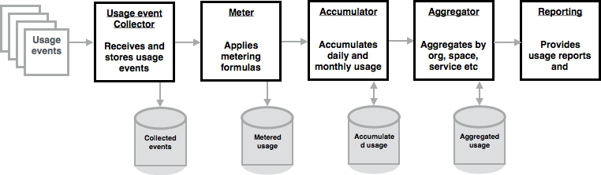
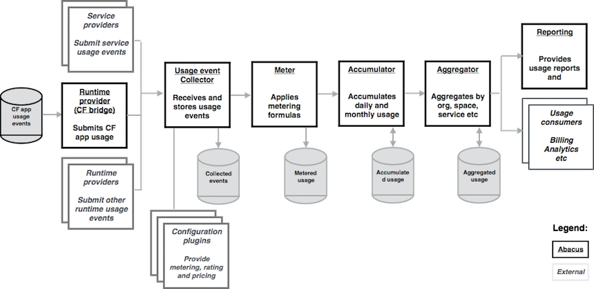
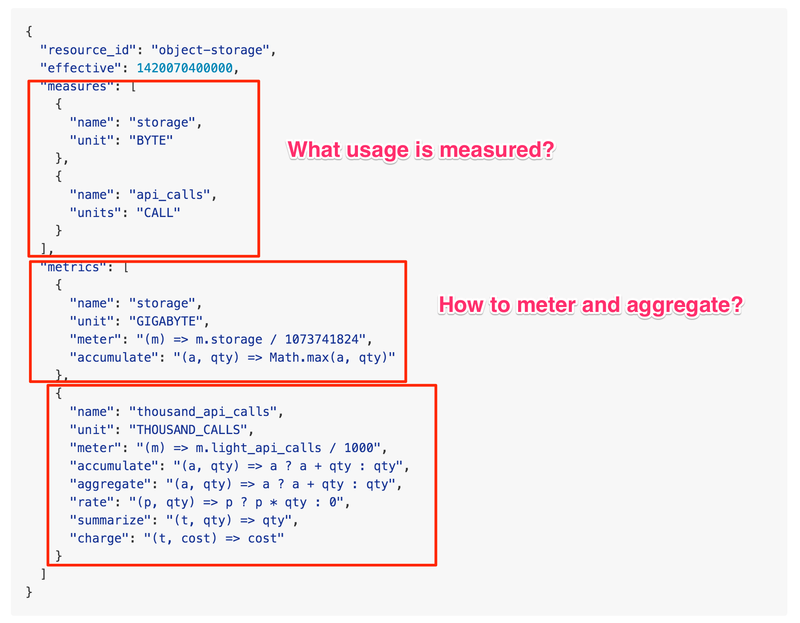
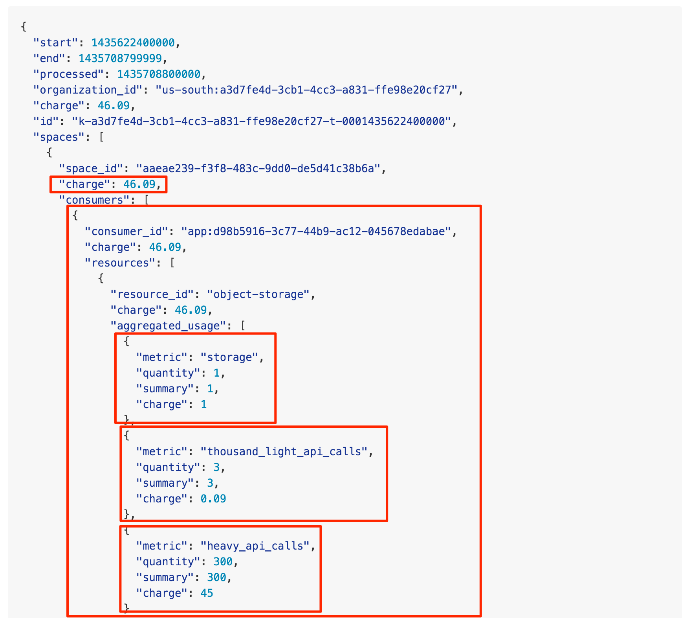

# Introduction to CF-Abacus - Part 2 of 3

CF-Abacus team: [Jean-Sebastien Delfino](https://github.com/jsdelfino) (IBM), [Saravanakumar Srinivasan](https://github.com/sasrin) "Assk" (Independent), [Benjamin Cheng](https://github.com/BetaFood) (IBM), [Hristo Lliev](https://github.com/hsiliev) (SAP), [Georgi Sabev](https://github.com/georgethebeatle) (SAP), [Kevin Yudhiswara](https://github.com/KRuelY) (IBM), [Piotr Przybylski](https://github.com/piotrprzybylski) (IBM), and [Rajkiran Balasubramanian](https://github.com/rajkiranrbala) (IBM)

## Introduction

In part 1 of this 3-part series, we motivated the metering problem for a Platform-as-a-Service (PaaS) like CloudFoundry (CF) and introduced and scoped CF-Abacus, which we claim provides a turnkey metering engine that can be used in a scalable manner by any CF installation. In this part, we dive into the architecture of CF-Abacus and also some of the key design points chosen by the team.

## Architecture Overview

CF-Abacus uses a pipeline architecture. The pipeline can be seen as containing six stages where each stage is responsible for processing, manipulating, saving, sorting, and reporting metering information. The following diagram illustrates the six stages which we elaborate on a bit more below.

The six stages of the CF-Abacus pipeline comprises:

1. Resource provider: at this stage in the pipeline service providers connect to Abacus to pump usage information into the system. Two main classes of resource providers exist, one is third-party services, that is CF service brokers that expose services to a CF environment. And second, the CF runtime itself which provides information about application lifecycle.
2. Usage event collector: at this stage in the pipeline the various resource providers are configured and are pushing usage data into the system. The job of this stage is to collect the usage information and store it and do some initial preprocessing.
3. Metering: the core of the Abacus pipeline is the stage that applies the metering formulas to the usage data. The resulting computation is also stored in a database.
4. Accumulator: since usage data is a constant stream, it needs to be accumulated over time (days, weeks, months, years) to make it useful for consumption. This stage does all accumulation processing.
5. Aggregator: while accumulated usage is more useful than individual usage, it’s even better when aggregated around logical identities, for instance organizations, spaces, applications, services, and users. In this stage the accumulation of the data around these known identities is performed.
6. Reporting: while usage information is useful when accumulated it’s even more useful when formatted in a report that spans time and potentially multiple identities. In the reporting stage, the Abacus system allow consumers to customize how the reported data is presented.

One of the main goals of this architecture is to allow flexibility and scaling. The flexibility goal is to enable the architecture to grow without major disruptions to the overall system. That is, new stages to the pipeline can be introduced somewhat easily.

Scalability is achieved by allowing the design of each stage to independently scale. Because the system is partitioned logically into stages that connect to each other, by scaling each component we can achieve an overall more scalable pipeline by focusing on the stages that are slow and scale them to achieve the performance needed.

## Design Goals

To support our architecture decisions we opted to design the CF-Abacus project as a collection of micro services. In its most obvious decomposition, each stage of the Abacus pipeline is exposed as a micro service with a REST API that is backed by a database. Following common 12-factor application patterns, this design means that each stage can scale independently using classic horizontal replications.

Furthermore, the resulting micro services applications are easily deployable and maintained in a Cloud Foundry deployment. This means that CF-Abacus can enjoy the same scaling and maintenance lifecycle and workflow as any other applications running in CF. Using the platform to run some parts of the platform is the effective result.

Naturally, any discussion of 12-factor applications or micro service requires mentioning where the data is being kept and managed in a separate service. This is no different. The various stages of the CF-Abacus pipeline require a database. And a database that scales to TB of data and that can easily be partitioned and sharded. Think of the resulting accumulated data for any one organization running 100s to 1000s of apps over a year. The resulting data is large and will keep growing.

The design goal for CF-Abacus to deal with this database problem is two fold. First, assume that the database will be provided by a CF service. So each stage (micro service) creates and connects to the database service to accumulate, query, and process the collected data. The database is assumed to be any CouchDB-compliant database. So access to the database (once connected) is via the known open CouchDB APIs.

To deal with the challenges of an ever growing database footprint, the micro services automatically shard the database using time partitions. This makes sense since the data flowing into the Abacus pipeline is always timestamped and more importantly the resulting access of the accumulated and reported data tends to be sensitive to the timespans that it represent. For instance, as a user of Abacus for billing, that would typically be interested in the data for latest time period, a goal would be to make the data for more recent time periods be readily available.

All usage submissions, provider configurations, and reports are done as JSON documents. This of course goes hand in hand with our choice of database, however, it also results in a flow which is both human and machine processable. After on-boarding a service provider (validating and adding their configuration) they are able to submit their usages. The following is an example usage with it's sections highlighted that conforms to the provider whose configuration is shown in the subsequent figure.

The second and third highlighted sections shown in the example provider usage configuration contains the details on how the usage data is to be metered and accumulated. The formulas are expressed in JavaScript and are used by the correct stage in the pipeline as the provider submits its usage information. After accumulation and aggregation, the resulting report is something that can readily be used to present to end-users or processed by a billing engine. The following is an example based on the provider above and similar submitted usages.

---

In the part 3 we will conclude this series with a discussion about the implementations decision to realize the architecture and design as well as brush up on future directions and goals for the CF-Abacus project.

## References

* CF-Abacus Github [project](https://github.com/cloudfoundry-incubator/cf-abacus)
* CF-Abacus [docs](https://github.com/cloudfoundry-incubator/cf-abacus/tree/master/doc): [README](https://github.com/cloudfoundry-incubator/cf-abacus/blob/master/README.md), [FAQs](https://github.com/cloudfoundry-incubator/cf-abacus/blob/master/doc/faq.md), and [API design](https://github.com/cloudfoundry-incubator/cf-abacus/blob/master/doc/api.md) information
* CF-Abacus [Slack](https://abacusdev-slack.mybluemix.net/) and [Gitter](https://gitter.im/cloudfoundry-incubator/cf-abacus?utm_source=badge) channels
